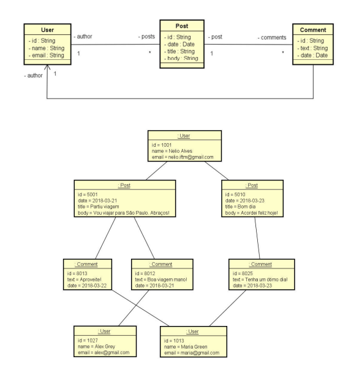
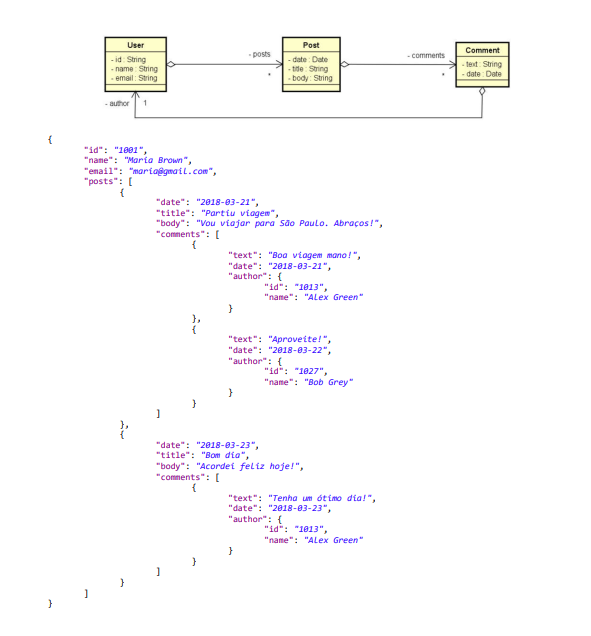

# API Restful com Spring Boot e MongoDB

## Resumo do Projeto

Este projeto consiste no desenvolvimento de uma API RESTful utilizando Spring Boot e MongoDB como banco de dados NoSQL. O principal objetivo foi explorar as diferenças entre bancos relacionais e orientados a documentos, além de implementar operações básicas de CRUD (Create, Read, Update, Delete) para usuários e posts.

A API permite gerenciar usuários e seus posts, suportando consultas avançadas, como busca por posts com filtros personalizados. O projeto também adota boas práticas de desenvolvimento, incluindo o uso de DTOs para otimização do tráfego de dados e o padrão Repository para a abstração da camada de persistência.

Além disso, foram utilizados Postman para testes dos endpoints e Git para versionamento do código, proporcionando uma experiência completa de desenvolvimento de uma API REST moderna e escalável.

## Objetivo Geral

- Compreender as principais diferenças entre paradigma orientado a documentos e relacional.
- Implementar operações de CRUD.
- Refletir sobre decisões de design para um banco de dados orientado a documentos.
- Implementar associações entre objetos:
    - Objetos aninhados.
    - Referências.
- Realizar consultas com Spring Data e MongoRepository.

## Diagrama de Classes


# Estrutura do Projeto

O código está organizado em pacotes conforme a seguinte estrutura:

## 📂 **src/main/java**
Contém os pacotes e classes do projeto.

## 📂 **domain**
Contém as classes de entidade do sistema.
- **User**: Representa a entidade Usuário.
- **Post**: Representa a entidade Postagem.

## 📂 **dto**
Contém as classes DTO (Data Transfer Object) para otimização dos dados trafegados.
- **UserDTO**: Projeção dos dados da entidade User.
- **AuthorDTO**: Projeção dos dados do autor de uma postagem.
- **CommentDTO**: Representação de um comentário associado a uma postagem.

## 📂 **repository**
Contém as interfaces de repositórios para acesso ao banco de dados.
- **UserRepository**: Interface para operações com a entidade User.
- **PostRepository**: Interface para operações com a entidade Post.

## 📂 **services**
Contém as classes de serviço que implementam a lógica de negócios.
- **UserService**: Implementa a lógica para gerenciamento de usuários.
- **PostService**: Implementa a lógica para gerenciamento de postagens.

## 📂 **services.exception**
Contém classes para tratamento de exceções.
- **ObjectNotFoundException**: Exceção personalizada para entidades não encontradas.

## 📂 **resources**
Contém as classes responsáveis pela exposição da API REST.
- **UserResource**: Controlador REST para operações com usuários.
- **PostResource**: Controlador REST para operações com postagens.

## 📂 **resources.exception**
Contém classes para tratamento global de erros na API.
- **StandardError**: Modelo de erro padrão para respostas HTTP.
- **ResourceExceptionHandler**: Classe para capturar e tratar exceções nas requisições.

## 📂 **config**
Contém classes de configuração do projeto.
- **Instantiation**: Classe responsável pela instanciação inicial do banco de dados com dados de teste.

## 📂 **util**
Contém classes auxiliares.
- **URL**: Classe utilitária para tratamento de parâmetros de URL.

## 📂 **application.properties**
Arquivo de configuração contendo as informações de acesso ao banco de dados MongoDB.

## 📂 **DemoApplication.java**
Classe principal do projeto, responsável pela inicialização da aplicação Spring Boot.

---

## Relação com MongoDB


## Relação com MongoDB em JSON

---

### Tecnologias Utilizadas
- **Java**
- **Spring Boot**
- **Spring Data MongoDB**
- **MongoDB**
- **Postman**
- **Git**

### Funcionalidades Implementadas
- Consultar usuário por ID.
- Consultar todos os usuários.
- Inserir novo usuário.
- Atualizar dados de um usuário.
- Excluir um usuário.
- Gerenciamento de posts associados a usuários.
- Consulta avançada de posts com filtros personalizados.

### Aprendizados
Durante o desenvolvimento deste projeto, foi possível aprofundar os conhecimentos sobre:
- Conexão de aplicações Java com bancos de dados NoSQL usando **Spring Data MongoDB**.
- Implementação do padrão **Repository** para abstração da camada de persistência.
- Uso do padrão **DTO** para otimizar o tráfego de dados na API.
- Diferenças entre **bancos de dados relacionais e orientados a documentos**.
- Utilização do **Postman** para testes de API.
- Versionamento de código com **Git**.  

## Como Rodar o Projeto Localmente

1. Clone o repositório:
   ```bash
   git clone https://github.com/hvgofernandes/workshop-springboot-mongodb.git
   ```
2. Entre no diretório do projeto:
   ```bash
   cd workshop-springboot-mongodb
   ```
3. Configure o arquivo `application.properties` com as informações de acesso ao seu banco de dados MongoDB.
4. Importe o projeto em sua IDE Java preferida (STS, IntelliJ, etc.).
5. Certifique-se de que as dependências estão corretamente configuradas (por exemplo, MongoDB Compass).
6. Rode a aplicação na pasta src/main/java:
   ```bash
   WorkshopmongoApplication
   ```
